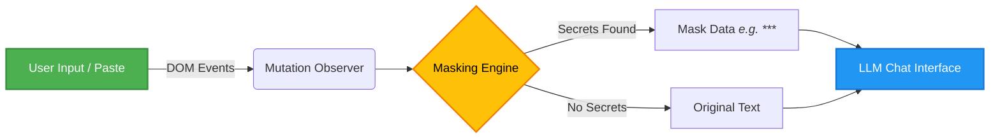
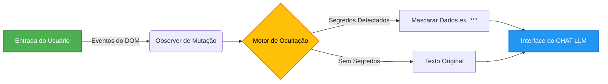
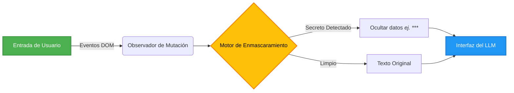
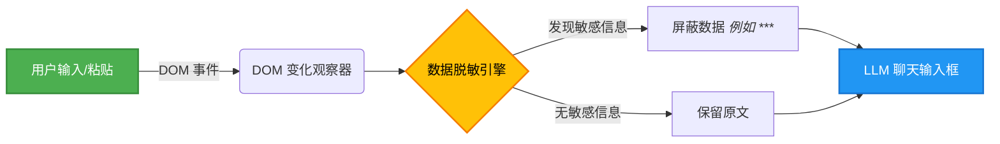
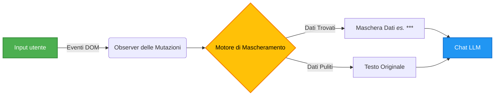
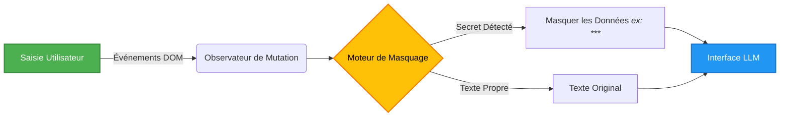
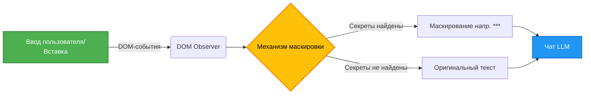

<div align="center">
  <h1>🛡️ LLM Prompt Purify</h1>
  <p><i>Client-side prompt sanitization extension for masking sensitive data before it reaches web-based LLMs.</i></p>
</div>

---

<details open>
<summary><b>🇺🇸 English (US) - Default</b></summary>

## 🛡️ LLM Prompt Purify

**LLM Prompt Purify** is a lightweight, pure TypeScript browser extension that intercepts and masks sensitive data directly within your browser. It prevents accidental leaks of PII, API keys, and credentials when dealing with web-based LLMs like ChatGPT and Claude.

### ✨ Key Features

- **Local Processing**: No data is ever sent to external servers. The scanning happens entirely in your browser.
- **Real-Time Interception**: Listens to keystrokes and pastes via DOM Observers.
- **Robust Rule Engine**: Detects API Keys, Credit Cards, Brazilian IDs (CPF/CNPJ), Emails, IPs, and more using regex and heuristic fuzzing.
- **Polyglot Mask Alphabet**: Optional Unicode masking mode interleaves characters from abugidas, syllabaries, Cyrillic/Armenian/Georgian, and math/arrow symbols — no two consecutive characters share the same writing-system family, making output impossible to decode.
- **Lightweight**: Pure TypeScript/Vanilla DOM implementation. Zero heavy frameworks.
- **Security Purification**: Detects and neutralizes XSS, SQL injection, XXE, and path traversal attacks in user content.

### 🔄 How it Works



### 💻 Development & Testing

We rely on modern testing infrastructure to ensure data is safely masked:

```bash
# Install dependencies
npm install

# Build the extension for Chromium browsers
npm run build

# Run Unit Tests (Jest — 77 suites / 7724 tests)
npm test

# Run E2E Tests (Playwright — 685 specs)
npm run test:e2e
```

</details>

<details>
<summary><b>🇧🇷 Português (BR)</b></summary>

## 🛡️ LLM Prompt Purify

O **LLM Prompt Purify** é uma extensão de navegador leve, construída puramente em TypeScript, que intercepta e oculta dados sensíveis diretamente no seu navegador. Evita o vazamento acidental de chaves de API, credenciais e dados pessoais (como CPF e CNPJ) ao utilizar LLMs baseados na web (como ChatGPT e Claude).

### ✨ Principais Funcionalidades

- **Processamento 100% Local**: Nenhum dado é enviado para servidores externos. Tudo acontece no seu próprio navegador.
- **Interceptação em Tempo Real**: Monitora digitação e colagem de textos via DOM Observers.
- **Motor de Regras Robusto**: Detecta senhas, cartões de crédito, CPFs, CNPJs, E-mails e IPs com alta precisão usando regex e validação heurística.
- **Leveza (Zero Dependências Pesadas)**: Implementação focada em performance usando TypeScript puro.
- **Purificação de Segurança**: Detecta e neutraliza ataques XSS, SQL injection, XXE e path traversal.

### 🔄 Como Funciona



### 💻 Desenvolvimento e Testes

```bash
# Instalar pacotes
npm install

# Compilar a extensão (Chromium)
npm run build

# Rodar testes unitários (Jest)
npm test
```

</details>

<details>
<summary><b>🌎 Español (LatAm)</b></summary>

## 🛡️ LLM Prompt Purify

**LLM Prompt Purify** es una extensión de navegador liviana creada en TypeScript puro que intercepta y oculta datos confidenciales directamente en tu navegador. Evita filtraciones accidentales de información personal (PII), claves de API y credenciales al usar LLMs como ChatGPT y Claude.

### ✨ Características Principales

- **Procesamiento Local**: Los datos nunca salen de tu navegador. No hay servidores externos.
- **Intercepción en Tiempo Real**: Escucha pulsaciones de teclas y acciones de pegar utilizando observadores del DOM.
- **Motor de Reglas Robusto**: Detecta tarjetas de crédito, identificaciones, correos electrónicos y direcciones IP utilizando expresiones regulares.
- **Extremadamente Rápido**: Implementación nativa, sin frameworks pesados.

### 🔄 Flujo de Trabajo



</details>

<details>
<summary><b>🇨🇳 中文 (ZH)</b></summary>

## 🛡️ LLM Prompt Purify

**LLM Prompt Purify** 是一个纯 TypeScript 编写的轻量级浏览器扩展程序，可在浏览器内部拦截并屏蔽敏感数据。当您使用基于 Web 的大语言模型（如 ChatGPT 和 Claude）时，它可以防止个人隐私 (PII)、API 密钥和凭据的意外泄露。

### ✨ 核心功能

- **纯本地处理**：数据绝不会发送到外部服务器。所有的扫描匹配工作都在您的浏览器中完成。
- **实时拦截**：通过 DOM 观察器实时监听键盘敲击和粘贴事件。
- **强大的规则引擎**：使用正则表达式和启发式探测检测 API 密钥、信用卡、电子邮件、IP 地址等。
- **轻量化**：原生 TypeScript 实现，无沉重的外部框架。

### 🔄 工作原理



</details>

<details>
<summary><b>🇮🇹 Italiano (IT)</b></summary>

## 🛡️ LLM Prompt Purify

**LLM Prompt Purify** è un'estensione per browser leggera scritta interamente in TypeScript. Intercetta e maschera i dati sensibili direttamente all'interno del tuo browser. Evita fughe accidentali di dati personali (PII), chiavi API e credenziali quando scrivi prompt per LLM basati sul web come ChatGPT e Claude.

### ✨ Caratteristiche Principali

- **Elaborazione Locale**: Nessun dato viene mai inviato a server esterni. La scansione avviene interamente nel tuo browser.
- **Intercettazione in Tempo Reale**: Ascolta la pressione dei tasti e gli appunti di testo copiato tramite DOM Observer.
- **Motore di Regole Robusto**: Rileva chiavi API, carte di credito, email, indirizzi IP e altro ancora.
- **Leggerissima**: Implementazione pura in TypeScript/Vanilla DOM.

### 🔄 Come Funziona



</details>

<details>
<summary><b>🇫🇷 Français (FR)</b></summary>

## 🛡️ LLM Prompt Purify

**LLM Prompt Purify** est une extension de navigateur légère en pur TypeScript qui intercepte et masque les données sensibles directement dans votre navigateur. Elle empêche les fuites accidentelles de données personnelles (PII), de clés API et d'identifiants lors de l'utilisation de LLM en ligne comme ChatGPT et Claude.

### ✨ Fonctionnalités Clés

- **Traitement Local** : Aucune donnée n'est envoyée vers un serveur externe. L'analyse se fait entièrement dans votre navigateur.
- **Interception en Temps Réel** : Surveille les saisies et les copier-coller via des observateurs du DOM.
- **Moteur de Règles Robuste** : Détecte les clés API, cartes de crédit, emails, IP etc. à l'aide d'expressions régulières (Regex).
- **Ultra-légère** : Implémentation pure en TypeScript.

### 🔄 Fonctionnement



</details>

<details>
<summary><b>🇷🇺 Русский (RU)</b></summary>

## 🛡️ LLM Prompt Purify

**LLM Prompt Purify** — это легковесное браузерное расширение на чистом TypeScript, которое перехватывает и маскирует конфиденциальные данные прямо в вашем браузере. Оно предотвращает случайную утечку персональных данных (PII), API-ключей и паролей при работе с веб-интерфейсами LLM (например, ChatGPT и Claude).

### ✨ Основные возможности

- **Локальная обработка**: Данные никогда не отправляются на внешние серверы. Сканирование происходит полностью в вашем браузере.
- **Перехват в реальном времени**: Отслеживает ввод с клавиатуры и вставку текста через DOM Observers.
- **Мощный механизм правил**: Обнаруживает API-ключи, кредитные карты, email-адреса, IP-адреса и другие данные с помощью регулярных выражений.
- **Легковесность**: Реализация на чистом TypeScript. Никаких тяжелых фреймворков.

### 🔄 Как это работает



</details>
